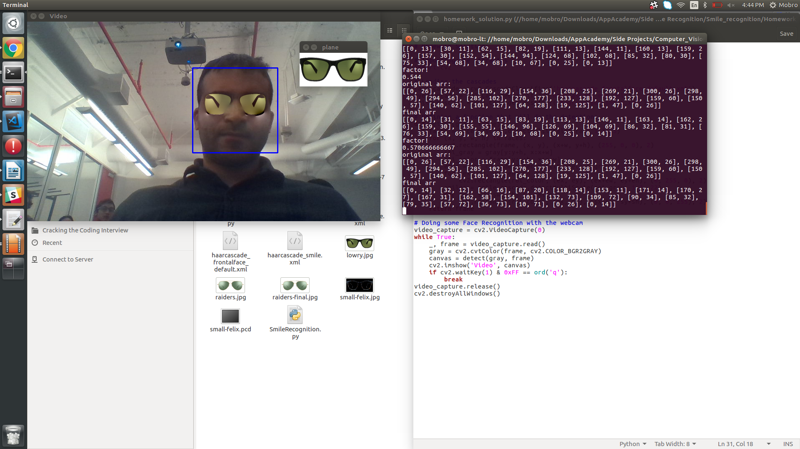
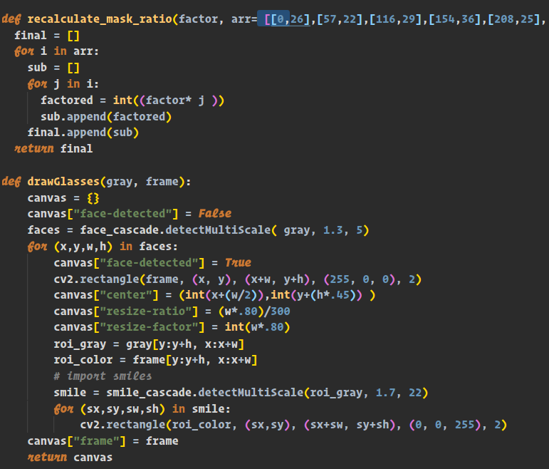

## GlassifyMe
Try on spectacles and sunglasses in real time!

This is my pet computer vision project built using simple Python OpenCV, Numpy, and the Anaconda Library. The app allows 
you to detect faces in real time using the Viola-Jones algorithim and the relevant haar-cascade. I used the same Haar-Casscade
Algorithims detailed by Viola and Jones back in 2001.

I wanted to scale the algorithim so not only to recognize the face, but to locate the pupils and place the spectacles over the face
This required constant resize and dynamic photoshop of an object, such that no matter the distance from the camera the spectacles
can be placed on the face in correct orientation. To do this, it requires dynamic photoshop, manipulation, and blending of the Alpha photoshop layer
which can also be done with numpy and some relatively simple logic:

Finially, I aimed to log the emotion of a user trying out certain pairs of spectacles. I wrote my own Haar cascade to detect smiles
and frowns. This was a complex task since I did not have many faces to train my recognition model on. However, as you can see
below (big) smiles and (big) frowns can be picked up and logged by the algorithim!

